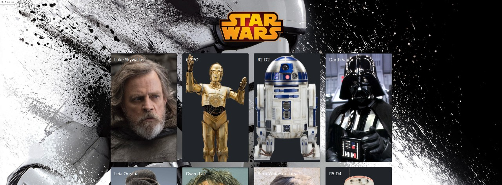

# README

This is a project made with Star Wars SWAPI API!



## Setup

### Prerequisites

The setups steps expect following tools installed on the system.

- Git
- Ruby 3.0.2
- Rails 6.1.4.1
- PostgreSQL

### Steps to run project

1. Clone this the repository:

```
    $ git clone git@github.com:CaioFML/star_wars_swapi.git
```

2. Go to the folder and bundle install:

```
    $ cd star_wars_swapi
    $ bundle install
```

2. Run yarn:

```
    $ yarn
```

4. Create and setup the database:

```
    $ rails db:setup
    $ rails db:migrate
```

4. Running tests:

```
    $ rails db:test:prepare
    $ bundle exec rspec
```

*The coverage of tests can be verified opening: `./coverage/index.html`*

5. Running rubocop:

```
    $ bundle exec rubocop
```

6.Running reek:

```
    $ bundle exec reek
```

6. Import all content from SWAPI API to populate database:
```
    $ rails import_star_wars_data:all
```

7. Run server and webpacker:
```
    $ rails s
    $ bin/webpack-dev-server
```
